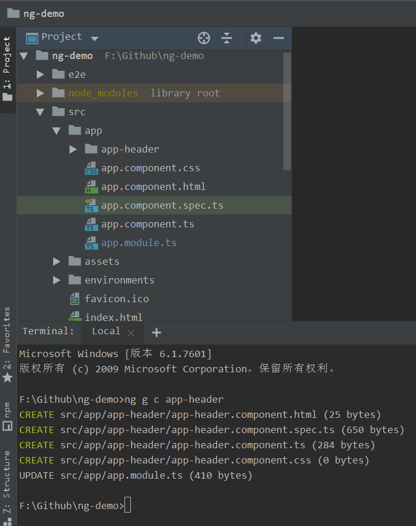

# Angular8+教程02-组件及组件内基础概念使用

[[TOC]]

## 介绍ng generate的概念与使用

ng generate是Angular-cli提供的生成器命令，用来生成Angular组件、类、服务、管道和路由等Angular套件模板。

详细内容可以参考[中文官方文档](https://angular.cn/cli/generate)

## 生成Angular组件

```javascript
ng g component app-header
// 该命令会在src/app下生成组件相关的ts、html和css文件
app-header/
    app-header.component.html
    app-header.component.ts
    app-header.component.css
    app-header.component.spec.ts
```



## 绑定数据

直接在app-header.component.ts中添加属性

```angular2

  // 绑定属性
  public name: string = '小泽小姐';
  private age: number = 18;
  protected sex: string = '女';
  bindHtml: string = '<h1>这是H1标签内容</h1>';

```

## 绑定标签属性

在HTML中添加[属性]="属性值";
```javascript
<div [id]="test" [data-id]="11">绑定元素属性</div>
```

## 数据循环

### [*ngFor](https://angular.cn/api/common/NgForOf#description) 

- 简单的循环

```javascript
<ul>
    <li *ngFor="let item of list">
        {{item}}
    </li>
</ul>
```

- 带索引和局部变量的


```javascript
// 如下 i就是每次循环的索引
// first 就是第一个的局部引用,此外还有奇even,偶数odd，last等
<ul>
    <li *ngFor="let item of list;index as i;first as isFirst; ">
        {{item}}
    </li>
</ul>
```

- trackBy支持带自定义函数处理


## 条件判断 *ngIf

```javascript

<p *ngIf="list.length > 3">这是 ngIF 判断是否显示</p>

<p template="ngIf flag">这是 ngIF 判断是否显示</p>

```

## switch结构*ngSwitch

```javascript

<ul [ngSwitch]="score"> 
    <li *ngSwitchCase="1">安装</li> 
    <li *ngSwitchCase="2">安装中</li> 
    <li *ngSwitchCase="3">已安装</li> 
    <li *ngSwitchDefault>未安装</li> 
</ul>

```

## 事件处理

```javascript

<button class="button" (click)="handle1()"> 点击按钮触发事件1 </button> 
<button class="button" (click)="handle2()"> 点击按钮触发事件2 </button>

```


## 表单事件

```javascript

<input type="text" (keyup)="keyFn($event)"/>


```

```javascript


// 方法
keyFn(e){ console.log(e) }

```


## 双向数据绑定

<input [(ngModel)]="inputValue">

```javascript

import { FormsModule } from '@angular/forms';

```

```javascript

<input type="text" [(ngModel)]="inputValue"/> 

跟踪显示：{{inputValue}}

```

## [ngClass]、[ngStyle]


```javascript
//ngClass
<div [ngClass]="{'class1': true, 'class2': false}"> 这是一个 div </div>

// ngStyle
<div [ngStyle]="{'background-color':'yellow'}">ngStyle 背景颜色</div>
```

## 管道
angular中的管道类似Vue中的过滤器，首先必须声明一个管道方法，然后在模板中使用

- 自带的管道

- 另外一种自定义的管道，需要先声明引入。

```javascript
<p>{{ new Date()| date:'yyyy-MM-dd HH:mm:ss' }}</p>
```
